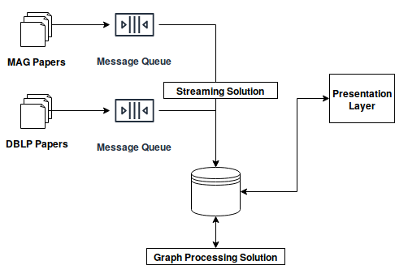
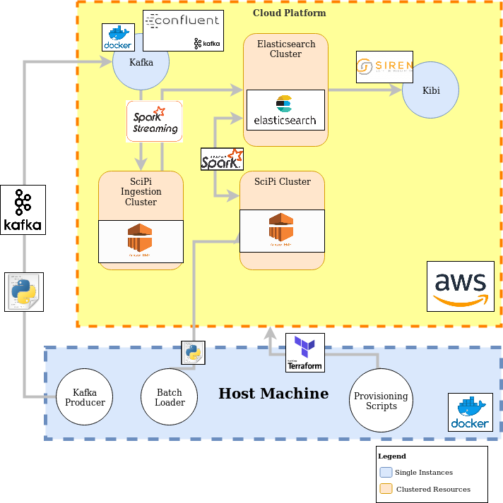

# SciPi - Scientific Publication Analytics
Welcome to SciPi - Scientific Publication Analytics; a project submitted in fullfillment for the ICS5114 Study Unit, Big Data Engineering as part of the Masters of Science in AI programme at the University of Malta. This document details the solution provided.
The main aim of this project is to demonstrate a real-time big data processing system, with the secondary aim being to perform network analysis on academic publication datasets.
The solution makes use of 2 data sources: Microsoft Academic Graph and DBLP Computer Science Dataset.

Author: Jake J. Dalli

E-mail: jake.dalli.10@um.edu.mt

[Read the paper submitted here.](paper.pdf)






## Usage
We have a Dockerfile inside the /src folder which allows us to run the solution in docker. The docker container creates an image which in turn allows us to deploy infrastructure, destroy infrastructure and run ingestion scripts. It is **important** to note that this application/docker file is **not** stateless, therefore if you kill the docker image, the application can still remain running and there is a good chance that you will need perform a manual teardown from within the AWS console. Therefore **do not** kill the docker image before everything is torn down. 
### Prerequisites
- Functional AWS account with default VPC that has no firewall restrictions. This is your responsibility to set up. 
- AWS IAM Access Key for an administrator account with full privelages on the AWS account. 
- AWS IAM Secret Key for an administrator account with full privelages on the AWS account.
- Knowledge of the target AWS region.
- A ready set up AWS VPC and Subnet to deploy to which is open to the public internet.

### Setting Cloud Details
Before running the solution, you must set up the cloud details. You may do this by setting them inside 'input.tf'. Ideally all instances have resources which are at minimum the equivalent of t2.xlarge. The file is already populated with defaults, so this is not strictly necessary.

### Set Up
1. **Set Cloud Details:** Modify ./src/input.tf to input credentials to the cloud. You must at least provide an AWS Access Key, AWS Secret Key and AWS region. You may modify the other defaults if you wish however the defaults will suffice for demo purposes.
2. **Run Docker:** To get the container up and running, cd into the src folder and run the following commands:

	```docker build -t scipi .```
	
	```docker run -i -p 8000-9000:8000-9000 -p 22:22 -p 443:443 --name scipi-container scipi```
3. Verify that the docker container is running by running ```docker ps -a```
4. Note that, running the docker container alone does not run or deploy the app, but instead creates a container which allows you to perform the operations detailed in 'Usage' below.

### Commands
To run commands within the container, execute the docker command: ```docker exec -it "scipi-container" /bin/bash```. This must be run in a separate terminal to that where the container was launched.
From within the docker container, you will be able to do the following:
1. Run the infrastructure create command using the shell script: ```./infra_setup.sh```. Note that before you run the infrastructure for the first time, you must perform the following actions:
	- If the directory exists, remove .terraform - this is a temporary directory kept only for posterity. Remove using the command ```rm -r .terraform```
	- Run the command ```terraform init``` to intialize the status. 
2. Run the infrastructure tear-down command using the shell script: ```./infra_destroy.sh```
3. Send MAG data to Kafka by running ```python ingestion/kafka-send.py 1``` (Note that this should be run in the background)
	- Note that the data here will ingest data within the ingesiton folder, there is sample data in this folder already.
4. Send OAG data to Kafka by running ```python ingestion/kafka-send.py 2``` (Note that this should be run in the background)
	- Note that the data here will ingest data within the ingesiton folder, there is sample data in this folder already.
5. To see infrastructure details after deployment, simply ```cat infra_values.json``` to get the addresses of the machines.

Note, sometimes jobs will fail (for a variety of reasons, not necessarily related to the data) while jobs are automated and scheduled, it is recommended they are also run manually when necessary.
Check out the next session to learn how to run the jobs.

### Spark Jobs
The spark jobs are configured to run every 5 minutes (within a cron) as per the provisoning script for spark. 
However there may be times where you might want to run the jobs separately. 

The two things you need are: 
- Public IP for the EMR Ingest Cluster (you can get this from infra_values.json)
- Public IP for the general processing cluster (you can get this from infra_values.json)

then you can ssh into them using the command from within the container:
```ssh -i scipi_ssh_key hadoop@<ip>``` 

These are the commands for running the jobs:

Command for runing the streaming job (must be run on the ingest cluster:)

```spark-submit --master yarn --deploy-mode cluster --executor-memory 2G --packages org.apache.spark:spark-network-common_2.11:2.3.2,org.elasticsearch:elasticsearch-hadoop:7.0.1,org.apache.spark:spark-streaming-kafka-assembly_2.11:1.6.3 --files spark-jobs/infra_values.json spark-jobs/ingestion-realtime-kafka.py```

Command for Poressing MAG papers:

```spark-submit --master yarn --deploy-mode cluster --executor-memory 4G --packages org.elasticsearch:elasticsearch-hadoop:6.7.2,org.apache.spark:spark-streaming-kafka-assembly_2.11:1.6.3 --files spark-jobs/infra_values.json /home/hadoop/spark-jobs/processing-data-mag.py```

Command for Processing DBLP papers:

```spark-submit --master yarn --deploy-mode cluster --executor-memory 4G --packages org.elasticsearch:elasticsearch-hadoop:6.7.2,org.apache.spark:spark-streaming-kafka-assembly_2.11:1.6.3 --files spark-jobs/infra_values.json /home/hadoop/spark-jobs/processing-data-dblp.py```

Command for Processing References:

```spark-submit --master yarn --deploy-mode cluster --executor-memory 4G --packages org.elasticsearch:elasticsearch-hadoop:6.7.2 --files spark-jobs/infra_values.json /home/hadoop/spark-jobs/processing-data-mag-references.py```

Command for LPA enrichment:

```spark-submit --master yarn --deploy-mode cluster --executor-memory 4G --packages org.elasticsearch:elasticsearch-hadoop:6.7.2,graphframes:graphframes:0.7.0-spark2.3-s_2.11,com.typesafe.scala-logging:scala-logging_2.11:3.5.0,com.typesafe.scala-logging:scala-logging-slf4j_2.11:2.1.2 --files spark-jobs/infra_values.json /home/hadoop/spark-jobs/processing-enrichment-lpa.py```

Command for for processing Graph edges:

```spark-submit --master yarn --deploy-mode cluster --executor-memory 4G --packages org.elasticsearch:elasticsearch-hadoop:6.7.2,com.typesafe.scala-logging:scala-logging_2.11:3.5.0,com.typesafe.scala-logging:scala-logging-slf4j_2.11:2.1.2 --files spark-jobs/infra_values.json /home/hadoop/spark-jobs/processing-relations.py```

### Tear Down
Be sure that before killing the docker container, you run the infrastructure destroy shell script to destroy the infrastructure.
You can kill the container by running ```docker kill scipi-container```.

### Infrastructure Inputs
This is a description of the infrastructure inputs, detailed in src/input.tf which can be set to define the infrastructure.

| Variable Name | Description  |
| ------------- |:-------------:| 
| project    | Project name, only used for naming convention. |
| aws_access_key | AWS Security Credentials Access Key | 
| aws_secret_key | AWS Security Credentials Secret Key | 
| aws_region | AWS Region to deploy infrastructure to     |
| target_vpc | Target VPC to deploy infrastructure to - must be created.    |
| target_subnet | Target subnet to deploy infrastructure to - must be created.      |
| kafka_instance_type | EC2 Instance Type fo use for Kafka|
| kafka_cluster_size | Unused - Ignore|
| es_instance_type |EC2 Instance Type to use for ElasticSearch |
| es_instance_count | Number of Elasticsearch nodes|
| es_ebs_size | Drive space for each Elasticsearch Node  |
| kibi_instance_type | EC2 Instance Type to use for Siren Investigate  |
| emr_release_label | Spark release label for EMR. Do not modify. |
| emr_master_instance_type | Instance Type for master node for main processing EMR cluster.      |
| emr_master_ebs_size | Disk space for the master node for the main processing EMR cluster. |
| emr_slave_core_instance_type | Instance type for the worker nodes for the Main EMR Cluster   |
| emr_slave_core_instance_count | Numer of worker nodes to deply in the main EMR Cluster     |
| emr_slave_core_ebs_size | Disk space for the worker nodes in the main EMR cluster.   |
| emr_ingest_master_instance_type | Instance type for the master node of the ingestion cluster.      |
| emr_ingest_master_ebs_size | Disk space for the master node of the ingesiton cluster.      |
| emr_ingest_slave_core_instance_type | Instance type for the worker nodes of the ingestion cluster.     |
| emr_ingest_slave_core_instance_count | Instance count for the worker nodes for the ingestion cluster.      |
| emr_ingest_slave_core_ebs_size | Disk space for the worker nodes of the ingestion cluster.     |


### Infrastucture Outputs
Upon deployment, a json file called infra_values.json will be outputted within the src folder. You can view this to view the deployed infrastructure's deailts. A description of each attribute is below:

| Variable Name | Description  |
| ------------- |:-------------:| 
| controller-ip    | IP address for a controller instance, this machine is only set up as a precaution for testing. |
| elasticsearch_instance | Public Ip addresses for the nodes of the elasticsearch cluster. | 
| elasticsearch_instance_priavteip | Private Ip addresses for the nodes of the elasticsearch cluster. | 
| emr_id | AWS EMR Id of the main processing cluster.    |
| emr_ingest_id | AWS EMR Id of the ingestion cluster.   |
| emr_ingest_master_public_dns | Public DNS of the ingestion cluster main node. |
| emr_ingest_name | Name of the main cluster.|
| emr_master_public_dns | Public IP of the main processing cluster. |
| emr_name | Name of the main processing cluster.|
| kafka_instance | IP address to the kafka isntance.  |
| kibi_instance | IP address to the siren investigate instance.  |
| output_aws_access_key | Access key used for deployment. |
| output_aws_region |  Region  used for deployment.      |
| output_aws_secret_key |  Secret key used for deployment. |
| output_spark_s3 | Name of the bucket used to output EMR logs.   |
| ssh_key_fingerprint | SSH key used for the deployment.    |
| ssh_key_name | SSH Key used for the deployment.   |
| ssh_key_public | SSH Key used for the deployment.      |


# Directory Structure

This directory is structured as follows:

 1. **/tmp:** TThis is a temporary directory to hold working files, either backups of data or jupyter notebooks containing some working examples. This is not part of the final solution and was only provided as a proof of work.
 2. **/docs:** Folder containing documents, including the *project specification* and *LATEX template for the assignment report.*
 3. **/src:** Folder containing all source code for the project.
	 1. **/siren-uploads:** Folder containing files to be uploaded for using siren dashboard, this incluses the license for using siren and the backup of the siren objects.
	 2. **/spark-jobs**: Folder containing spark jobs which are run on the EMR cluster.
	 3. **/ingestion**: Contains scripts used to send data to SciPi as well as sample data to send.
		 1. **/data-mag:** Folder containing sample files for the Microsoft Academic Graph dataset. This folder is used to hold data which is automatically sent to the data-mag Kafka topic.
		 2. **/data-other:** Folder containing sample files for the DBLP dataset. This folder is used to hold data which is automatically sent to the data-other Kafka topic.
		 3. **kafka-send.py:** Python script used to send data to Kafka, creates a Kafka producer and reads data from data-mag or data-other to send to the system, depending on argument variables.
		 4. **kafka-recv.py:** Python script used to receive data from Kafka, creates a Kafa consumer. Only used for debugging purposes.
		 5. **batch-send.py:** Python script which loads data directly into Elasticsearch, only used for debugging purposes.
	 4. **/modules:** Folder containing Terraform modules for the deployment of S3 buckets and EMR clusters. Used by terraform scripts for better modularization.
	 5. **/provisioners** Folder containing all scripts which are run post-terraform for provisioning.
		 1. **/elasticsearch-code** Folder containing code for every elasticsearch node, which is deployed to each node.
		 2. **/kafka-code** Dockerized Kafka instance by Confluent for the setup of Kafka.
		 3. **/kibi-code** Code which is deployed to the Kibi instance during provisioning.
		 4. **controller.sh** Shell script used to download data from the official sites, only used for debugging purposes.
		 5. **initialize_es.py**: Python script for initializing Elasticsearch instances via ssh.
		 6. **initialize_kafka.py**: Python script for initializing Kafka instances via ssh using Docker.
		 7. **initialize_kibi.py**: Python script for intializing Kibi (Siren Investigate) via ssh.
		 8. **initialize_spark.py**: Python script for sending spark jobs and running spark jobs on the EMR clusters.
		 9. **teardown_kibi.py**: Pyhton script used to persist Kibi objects - not fully operational and only used for debugging purposers.
		 10. **emr_bootstrap_actions.sh**: Bootstrap actions which are run on all EMR nodes for post-initialization setup and configuration.
		 11. **emr_pyspark_setup.sh**: A shell script used to initialize spark on EMR instances. 
	 6. **maint.tf:** Contains the terraform specifications for our resources, uses input.tf and output.tf to read/write variables.
	 7. **input.tf:** Contains the input variable definitions for our terraform scripts, modify the defaults here to change the specifications of the SciPi system.
	 8. **output.tf:** Specifies what variables to output to infra_values.json for provisioning.
	 9. **infra_setup.sh**: This shell script runs all the necessary scripts to provision our system.
	 10. **infra_destroy.sh**: This shell script runs all the necessary scripts to tear down our system.
	 11. **infra_values.json**: This JSON file is written during deployment, therefore it is a working file. It contains the details of all our AWS resources, and is used by our provisioning scripts to provision dhe systems.
	 12. **scipi_ssh_key**: The ssh key used to access all our resources.
	 13. **scipi_ssh_key.pub**: The public key used to generate the ssh key.
	 14. **terraform.tfstate**: This file stores the state of our infrastructure, used during infrastructure seutp and destroy.


## Notes

 - If you wish to demo, it is a good idea to only send data to the data-mag topic, because sending data to both topics will be slow if you do not dedicate enough resources to the Kafka machine, remeber that it is a single instance machine.
 - All resources are deployed to your default security group - make sure that this has the necessary firewall rules (probably you can just open them to public). Security for this project is out of scope, therefore not much attention was paid to it.
 - Disclaimer: I am not responsible for any financial burden you may encounter when testing the solution. Always be sure to check the AWS documentation to understand how much you are spending when deploying the project.